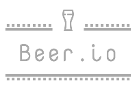

<div align="center">
    
    <br>
    <b>Beer.io</b> is the reference to search for good beers to drink. 
    It is community-based, so feel free to leave a comment about how you've experienced a beer. Enjoy !
</div>

## Realisation
The project is realised in the course "T-SoftwEng" of the Master-MSE. The application is developed by **Laurent Chassot**.

The following constraints have been taken in account:
- A Vue.js project
- Run Vuex to make the interaction between components easier
- Can be deployed with Docker
- Is based on a realistic subject (LoremIpsum-free)
## Project setup
```
npm install
```

### Compiles and hot-reloads for development
```
npm run serve
```

### Compiles and minifies for production
```
npm run build
```

### Run on Docker
```
# Build the Docker image
sudo docker build -t beer-io/docker .
# Launch the application
sudo docker run -it -p 8080:8080 --rm --name beer.io beer-io/docker
```

### Lints and fixes files
```
npm run lint
```

### Customize configuration
See [Configuration Reference](https://cli.vuejs.org/config/).
